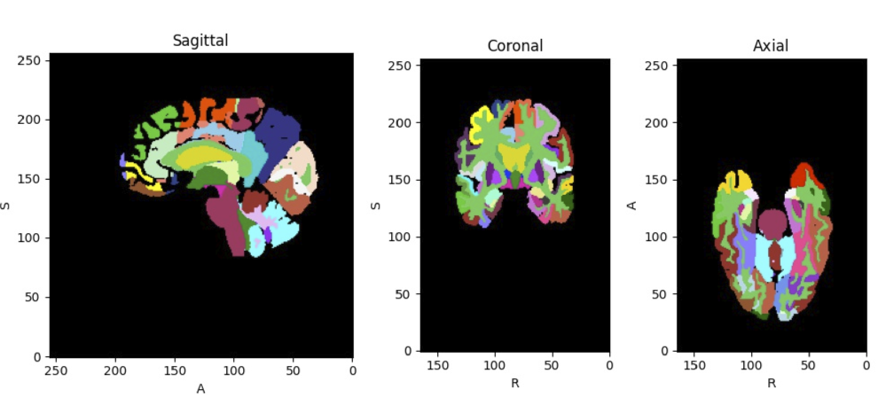

# To do
- [ ] Need to add the loss in the validation to compare
- [ ] read other people's patch size (?), and training time, and learning rate
- [ ] check the learning rate 
- [ ] check what I did in the padding part
- [ ] Try dropout
- [ ] the filter in each layer might need to change
- [ ] try transfer learning to speed up training
- [ ] why the training loss label all equal to 1
- [ ] might need more place to overlap with each other(could be a place to dip into) (how to remove borders) (look for the border pharams) (how the torchio deal with the overlapping part?)
- [ ] read about the learning rate
- [ ] why the matrix is different from the loss??
- [ ] why the print network show so less information now?
- [ ] tune the patch based parameters to make the train faster
- [ ] remember to find the suitable patch size
- [ ] make a parameter of whether to compute the background
- [ ] to test the dice loss
- [ ] add more Fully Connected Layer(???)
- [ ] rewrite the test part
- [ ] add one more layer without using concat
- [ ] force to upload once to github to clear some redundant file

# Reading to do 
- [ ] Reading the paper: Bringing Background into the Foreground:
Making All Classes Equal in Weakly-supervised Video Semantic Segmentation (Whether to include the background??)
- [ ] Finding more paper to read!

## Try
- [ ] using leave one out validation

# visualization part
- [X] find out why Clipping input data to the valid range for imshow with RGB data ([0..1] for floats or [0..255] for integers)_. (if still cannot fix, we can go along with the gray image)
- [X] find out the reason why the second row of visualization do not working
- [X] make the data plot according to the original scale
- [X] why the color part isn't right????
- [ ] add mp4 part in the validation step end later
- [ ] adding the name of each axs

## Some code that might be useful
- in utils, there is a squeeze_data.py file which is used for squeeze
the label data (in ADNI, label data have an extra dimension like this (1, 192, ))

# The elements of networks
- loss function and matrixs: all compute the background 
- the visualization part:
    0. Using the whole brain volume to do the visualization part
    1. randomly choose 150 images (but every time the image is fixed) from the 1069 baseline images in the ADNI dataset
    2. using this images to do visualization everytime (with the same order every time)

# Some Performance
- if not using resample, using the orginal dice loss ( reduce by mean ), the loss would drop at a special moment to around 0.4, and all predict the background class. 
- But after using the resample, cropped, and GeneralizedDiceLoss. The model would not learn at all ( the loss is always around 1). Very weird
- ddp2 cannot be used in Compute Canada
- When I directly using the patches to compute the dice score, it return quite small number (almost equal to 0), but when I use the whole image to compute, it would return the normal number
- Let my model run with only one GPU, ( this isn't helping anything at all )

